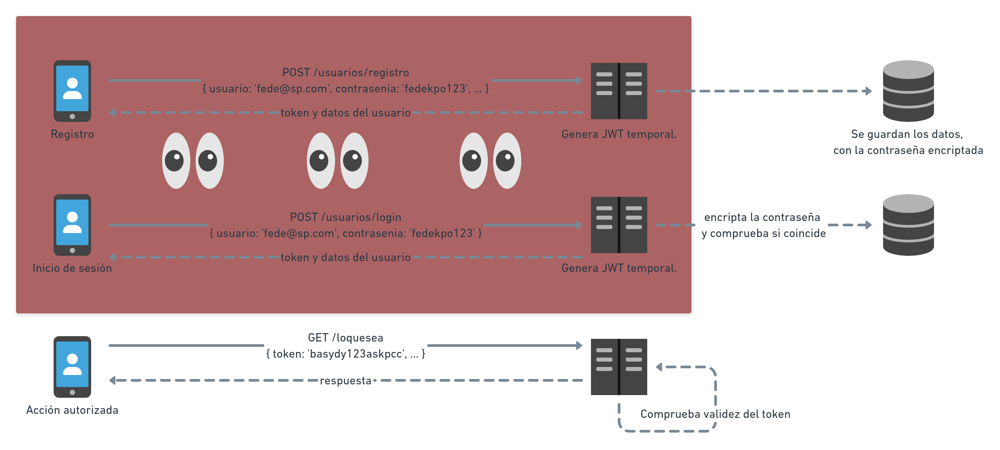

# Autenticación en NodeJS


===

## ¿Autenticación o autorización?


--

### Autenticación

En su variante más simple, pediremos usuario y contraseña, para luego validar contra nuestra base de datos. 

**Nunca jamás** vamos a guardar las contraseñas sin encriptar, en ningún lado. Ni mandarlas por mail. 🤬

--

### Autorización

Una vez que validamos que la persona **es quien dice ser**, nuestro sistema tiene que decidir qué puede hacer.

Las variantes son miles, desde bloquear acceso a ciertos recursos hasta mostrar solo una porción de los datos. Dependerá de qué estemos construyendo.

--

Hoy veremos cómo implementar una autenticación usuario-contraseña en NodeJS, utilizando herramientas estándar que nos garantizan un nivel de seguridad _aceptable_ para una aplicación no crítica.

**¡Comencemos!** 💪

===

## Flujo de autenticación



--

### Registro

El/la usuaria ingresa sus datos, incluyendo la **contraseña** que utilizará en adelante.

Si todas las validaciones que querramos hacer son exitosas, se crea un nuevo usuario y se devuelve un **token** (ya volvemos sobre esto).

--

### Login

Muy similar al registro, solo que aquí se ingresa solamente usuario y contraseña.

Si existe y las contraseñas coinciden, se devuelve un **token**. Si eso no ocurre, mostramos algún mensaje de error que no brinde _demasiada información_.

--

### Acciones autorizadas

En adelante, con cada pedido que le hacemos al servidor se envía el **token**.

Suele utilizarse el código de respuesta `403 (Forbidden)` para indicar que no se cuenta con los permisos necesarios.

===

## Encriptación de las contraseñas

Utilizaremos `bcrypt`, un algoritmo cuya fortaleza radica en que podemos decidir **qué tan lento** queremos que sea. ⏳

De esta forma, los ataques de fuerza bruta se vuelven _prácticamente imposibles_, por más hardware que tengas.

--

Este algoritmo toma dos parámetros: el texto a encriptar y un _factor de carga_, que determina cuán costoso va a ser el cómputo.

```js
bcrypt.hashSync('fede1234', 10)
// $2b$10$sj0DKPMSt0PzZW.bwpWQ3O5lkbZQI83xoHt8s5RTNdRhNJBS.IfGq
// 0s 89.224539ms

bcrypt.hashSync('fede1234', 12)
// $2b$12$1divaMspNFV81NTPLjM6g.tsEpLptH5baXw2JckpS8ZDrbU4uu17S
// 0s 211.040039ms

bcrypt.hashSync('fede1234', 18)
// $2b$18$lnRhCYh7.uv54FTvWjvvSepgLF48c9naYr14kPA6T02Pzj7cW5vjK
// 12s 648.522698ms
```

--

Con un _servidor moderno_, tomaría **40 segundos** probar _todas las combinaciones posibles_ de una contraseña alfanumérica de 6 caracteres hasheada con MD5. 

Esta misma tarea con bcrypt usando un factor de carga de 12, tomaría aproximadamente **12 años**. 
<!-- .element: class="fragment" -->

<small>Fuente: https://codahale.com/how-to-safely-store-a-password/</small> <!-- .element: class="fragment" -->

===

## JSON Web Tokens (JWT)

Sirve como una especie de **llave descartable** que utilizamos para hacer pedidos autorizados a la API.


--

Se le configura un **secreto** y un **tiempo de expiración**.

```js
const SECRET = 'P1rul0!';
const DURACION_SEGUNDOS = 120;

jwt.sign(
  { id: 4, nombre: 'Federico Aloi' }, 
  SECRET, 
  { expiresIn: DURACION_SEGUNDOS }
)

// eyJhbGciOiJIUzI1NiIsInR5cCI6IkpXVCJ9.
// eyJpZCI6NCwibm9tYnJlIjoiRmVkZXJpY28gQWxvaSIsImlhd
// CI6MTYyMzc3NzQyMywiZXhwIjoxNjIzNzc3NTQzfQ.vsn9Tcc9rDULuC
// PrNbUz2Slpul4DYtR_HYdsk7IXYME
```

--

```js
jwt.verify(token, SECRET)

// CASO FELIZ:
// { exp: 1623777728, iat: 1623777608, 
//  id: 4, nombre: 'Federico Aloi' }

// TOKEN VENCIDO:
// { name: 'TokenExpiredError', message: 'jwt expired', 
// expiredAt: 1408621000 }
```

===

## ¡Manos a la obra! 🦾

<small>[machete](https://livecodestream.dev/post/a-practical-guide-to-jwt-authentication-with-nodejs/)</small>

===

## Otros caminos posibles

* **Login sociales:** Passportjs
* **Servicios en la nube:** https://auth0.com/

===
# ¿Preguntas?

<div class="red-social">
  <i class="fab fa-youtube color"></i>
  <span><a href="https://youtube.com/c/elsurtambienprograma">El Sur también programa</a></span>
</div>
<div class="red-social">
  <i class="fab fa-telegram-plane color"></i>
  <span><a href="https://t.me/surprograma">@surprograma<a></span>
</div>
<div class="red-social">
  <i class="fab fa-instagram color"></i>
  <span><a href="https://instagr.am/surprograma">@surprograma<a></span>
</div>


